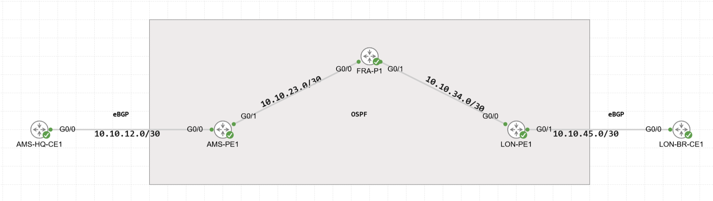
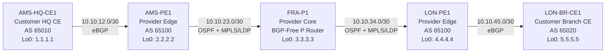

# Cisco Enterprise / Service Provider QoS Lab

A hands-on **CCNP Enterprise QoS lab** built in Cisco CML using Cisco IOSv routers.

The project demonstrates end-to-end Quality of Service across an Enterprise WAN and Service Provider core, including:

- Traffic classification
- DSCP marking
- LLQ
- CBWFQ
- Hierarchical QoS
- Traffic shaping
- Traffic policing
- WRED
- QoS trust boundaries
- DSCP spoofing protection
- IP SLA traffic generation
- OSPF
- BGP
- MPLS / LDP
- Bidirectional provider QoS

The lab was built while studying for **Cisco CCNP Enterprise ENCOR 350-401**.

---

# Network Topology

## Cisco CML Topology



The topology consists of two customer edge routers connected across a three-router Service Provider network. The provider core uses OSPF and MPLS/LDP, while eBGP connects each customer site to the Provider Edge.

## Logical Topology



Physical topology:

```text
AMS-HQ-CE1 ---- AMS-PE1 ---- FRA-P1 ---- LON-PE1 ---- LON-BR-CE1
 Customer CE       PE           P            PE          Customer CE
   AS65010                  Provider AS65100                AS65020
```

---

# Device Roles

| Device | Role |
|---|---|
| `AMS-HQ-CE1` | Enterprise HQ CE, classification, DSCP marking and customer HQoS |
| `AMS-PE1` | Provider edge, HQ trust boundary and provider egress QoS |
| `FRA-P1` | BGP-free MPLS provider core router |
| `LON-PE1` | Provider edge, Branch trust boundary and provider egress QoS |
| `LON-BR-CE1` | Enterprise Branch CE, classification, DSCP marking and customer HQoS |

---

# Addressing

## WAN Links

| Link | Device | Interface | Address |
|---|---|---|---|
| HQ ↔ AMS PE | AMS-HQ-CE1 | Gi0/0 | `10.10.12.1/30` |
| HQ ↔ AMS PE | AMS-PE1 | Gi0/0 | `10.10.12.2/30` |
| AMS PE ↔ FRA P | AMS-PE1 | Gi0/1 | `10.10.23.1/30` |
| AMS PE ↔ FRA P | FRA-P1 | Gi0/0 | `10.10.23.2/30` |
| FRA P ↔ LON PE | FRA-P1 | Gi0/1 | `10.10.34.1/30` |
| FRA P ↔ LON PE | LON-PE1 | Gi0/0 | `10.10.34.2/30` |
| LON PE ↔ Branch | LON-PE1 | Gi0/1 | `10.10.45.1/30` |
| LON PE ↔ Branch | LON-BR-CE1 | Gi0/0 | `10.10.45.2/30` |

## Router IDs

| Device | Loopback0 |
|---|---|
| AMS-HQ-CE1 | `1.1.1.1/32` |
| AMS-PE1 | `2.2.2.2/32` |
| FRA-P1 | `3.3.3.3/32` |
| LON-PE1 | `4.4.4.4/32` |
| LON-BR-CE1 | `5.5.5.5/32` |

---

# Enterprise Service Networks

## Amsterdam HQ

| Traffic Class | Network | Interface |
|---|---|---|
| Users | `192.168.10.0/24` | Loopback10 |
| Voice | `192.168.20.0/24` | Loopback20 |
| Video | `192.168.30.0/24` | Loopback30 |
| Critical Data | `192.168.40.0/24` | Loopback40 |
| Bulk Data | `192.168.50.0/24` | Loopback50 |

## London Branch

| Traffic Class | Network | Interface |
|---|---|---|
| Users | `192.168.110.0/24` | Loopback110 |
| Voice | `192.168.120.0/24` | Loopback120 |
| Video | `192.168.130.0/24` | Loopback130 |
| Critical Data | `192.168.140.0/24` | Loopback140 |
| Bulk Data | `192.168.150.0/24` | Loopback150 |

---

# Routing Architecture

## OSPF

The Service Provider core uses OSPF Area 0 between:

```text
AMS-PE1 ---- FRA-P1 ---- LON-PE1
```

The CE-facing links are not advertised into the provider OSPF domain.

Routing hygiene includes:

- Explicit OSPF router IDs
- `passive-interface default`
- Only provider transit interfaces enabled as non-passive
- Authentication on provider OSPF adjacencies

---

# BGP Architecture

## Customer Edge eBGP

```text
AMS-HQ-CE1 AS65010
        |
       eBGP
        |
AMS-PE1 AS65100
```

```text
LON-PE1 AS65100
        |
       eBGP
        |
LON-BR-CE1 AS65020
```

## Provider iBGP

```text
AMS-PE1 Lo0 2.2.2.2
        |
       iBGP
        |
LON-PE1 Lo0 4.4.4.4
```

The provider P router `FRA-P1` remains **BGP-free**.

---

# MPLS Transport

MPLS / LDP is enabled only inside the provider core:

```text
AMS-PE1 ---- FRA-P1 ---- LON-PE1
```

MPLS is not enabled on customer-facing interfaces.

The design demonstrates a provider core where:

- PE routers run BGP
- P router remains BGP-free
- LDP distributes labels
- MPLS transports customer traffic across the provider core
- Penultimate Hop Popping can be observed in the MPLS forwarding table

MPLS QoS / Traffic Class mapping is intentionally outside the current scope because this project focuses on ENCOR QoS fundamentals.

---

# QoS Traffic Classes

| Traffic | DSCP | PHB | Treatment |
|---|---:|---|---|
| Voice | 46 | EF | LLQ |
| Video | 34 | AF41 | CBWFQ |
| Critical Data | 26 | AF31 | CBWFQ |
| Bulk Data | 8 | CS1 | Low bandwidth + WRED |
| Best Effort | 0 | Default | Default queue |

---

# Customer Edge QoS

Both customer CE routers classify traffic based on the source service network.

Example HQ classification:

```text
192.168.20.0/24 -> Voice
192.168.30.0/24 -> Video
192.168.40.0/24 -> Critical
192.168.50.0/24 -> Bulk
Other traffic   -> Best Effort
```

The customer QoS child policy uses:

| Class | Treatment |
|---|---|
| Voice | `priority percent 20` |
| Video | `bandwidth percent 30` |
| Critical | `bandwidth percent 25` |
| Bulk | `bandwidth percent 5` + WRED |
| Default | Remaining bandwidth |

The permanent customer WAN parent shaper is:

```text
1 Mbps
```

---

# Hierarchical QoS

The customer WAN design uses hierarchical QoS:

```text
Parent Policy
|
|-- Shape aggregate WAN traffic
|
`-- Child Policy
    |
    |-- Voice
    |-- Video
    |-- Critical
    |-- Bulk
    `-- Best Effort
```

This allows congestion to be intentionally created in the lab so that QoS queueing behavior becomes visible.

---

# QoS Trust Boundary

Customer DSCP markings are **not blindly trusted** by the Service Provider.

At the provider edge, privileged QoS markings must satisfy:

```text
Expected source network
AND
Expected DSCP marking
```

Example legitimate Voice:

```text
Source: 192.168.20.0/24
DSCP:   EF 46

Result:
Trusted Voice
```

Example spoofed Voice:

```text
Source: 192.168.10.0/24
DSCP:   EF 46

Result:
Not trusted
-> class-default
-> DSCP reset to 0
```

This demonstrates how a provider can prevent a customer from marking arbitrary traffic as high-priority EF.

---

# Provider Egress QoS

Both Provider Edge routers implement an **800 kbps shaped customer service**.

```text
Provider Core
     |
     v
Provider Edge
     |
     | Parent Shaper: 800 kbps
     |
     +-- Voice     LLQ 20%
     +-- Video     BW 30%
     +-- Critical  BW 25%
     +-- Bulk      BW 5% + WRED
     +-- Default   Remaining BW
     |
     v
Customer CE
```

At 800 kbps:

| Class | Allocation |
|---|---:|
| Voice | 160 kbps LLQ |
| Video | 240 kbps minimum |
| Critical | 200 kbps minimum |
| Bulk | 40 kbps minimum |
| Default | Remaining bandwidth |

---

# Important QoS Concepts Demonstrated

## Classification and Marking

MQC is used to classify traffic and apply DSCP markings.

```text
class-map
    ↓
policy-map
    ↓
service-policy
```

---

## LLQ

Voice uses:

```text
priority percent 20
```

The lab demonstrates that LLQ provides strict priority during congestion, but sustained traffic exceeding the configured LLQ allowance can be dropped.

---

## CBWFQ

Video and Critical Data use bandwidth guarantees.

Important observation:

```text
bandwidth percent
```

defines a **minimum guaranteed bandwidth**, not a maximum rate.

Classes can borrow unused bandwidth when it is available.

---

## Shaping

Traffic shaping buffers excess traffic and releases it according to the configured rate.

The lab compares:

```text
shape average
```

against policing behavior.

---

## Policing

Both single-rate and two-rate policing were tested.

Two-rate three-color policing demonstrated:

```text
Conform
Exceed
Violate
```

with different actions including:

- Transmit
- Remark
- Drop

---

## WRED

Bulk traffic uses DSCP-based WRED.

The lab demonstrates:

- Minimum threshold
- Maximum threshold
- Mark probability
- Mean queue depth
- Random drops
- Tail drops

It also demonstrates that WRED operates using an **average queue depth**, not simply the instantaneous queue size.

---

# AF Drop Precedence Experiment

AF31 and AF33 were temporarily compared using different WRED thresholds.

The experiment demonstrated:

```text
AF31 -> Lower drop precedence
AF33 -> Higher drop precedence
```

and showed AF33 experiencing earlier/more aggressive drops under congestion.

---

# Bandwidth Guarantee vs Rate Limit

A key experiment compared:

```text
bandwidth percent 5
```

with:

```text
shape average 40000
```

Results demonstrated:

```text
bandwidth percent 5
= 40 kbps minimum guarantee
= Class may borrow additional bandwidth
```

while:

```text
shape average 40000
= approximately 40 kbps rate cap
```

This is an important distinction between scheduling and shaping.

---

# IP SLA Traffic Generation

Cisco IP SLA UDP-jitter operations are used to generate reproducible traffic.

Traffic classes originate from their respective loopback interfaces.

Example:

```text
HQ Voice
192.168.20.1
      |
      | UDP-Jitter
      v
192.168.120.1
Branch Voice
```

The lab uses IP SLA to create repeatable congestion scenarios without requiring additional traffic-generator nodes.

---

# Bidirectional QoS

QoS was validated in both directions.

## HQ to Branch

```text
AMS-HQ-CE1
     |
     | Classification
     | DSCP Marking
     | HQoS
     v
AMS-PE1
     |
     | Trust Boundary
     v
FRA-P1
     |
     | MPLS Transport
     v
LON-PE1
     |
     | Provider Egress QoS
     v
LON-BR-CE1
```

## Branch to HQ

```text
LON-BR-CE1
     |
     | Classification
     | DSCP Marking
     | HQoS
     v
LON-PE1
     |
     | Trust Boundary
     v
FRA-P1
     |
     | MPLS Transport
     v
AMS-PE1
     |
     | Provider Egress QoS
     v
AMS-HQ-CE1
```

---

# Key Lab Scenarios

The project includes practical testing of:

- ACL-based traffic classification
- DSCP marking
- EF Voice treatment
- AF41 Video treatment
- AF31 Critical Data treatment
- CS1 Bulk / scavenger treatment
- Best Effort traffic
- LLQ behavior
- CBWFQ bandwidth guarantees
- Hierarchical WAN shaping
- Shaping versus policing
- Two-rate three-color policing
- WRED congestion avoidance
- AF drop precedence
- QoS trust boundaries
- DSCP spoofing
- DSCP remarking
- Provider-side congestion
- Bidirectional QoS
- Bandwidth guarantees versus rate caps
- IP SLA traffic generation
- QoS drop accounting

---

# Example Congestion Result

During an 800 kbps provider congestion test:

```text
Voice drops
+ Video drops
+ Critical drops
+ Bulk drops
+ Best Effort drops
=
Parent shaper drops
```

This allowed QoS queue behavior to be correlated directly with the parent congestion statistics.

---

# Packet Capture

Packet captures will be added as final verification evidence.

Planned captures include:

### Legitimate Voice

```text
HQ CE
DSCP EF 46
     |
     v
Provider
     |
     v
Branch CE
DSCP EF 46
```

### Spoofed EF

```text
Users Network
Source: 192.168.10.1
DSCP: EF 46
      |
      v
AMS-PE1 Trust Boundary
      |
      v
Remark DSCP 0
```

Wireshark filters:

```text
ip.dsfield.dscp == 46
ip.dsfield.dscp == 34
ip.dsfield.dscp == 26
ip.dsfield.dscp == 8
ip.dsfield.dscp == 0
```

---

# Basic Security and Device Hardening

The final lab includes basic network-device hygiene such as:

- SSHv2
- Local user authentication
- Telnet disabled
- HTTP server disabled
- Console timeout
- VTY timeout
- Logging timestamps
- Buffered logging
- Interface descriptions
- OSPF authentication
- BGP session authentication

This security configuration is intentionally limited in scope because the primary focus of this project is QoS.

---

# Lab Access

A low-privilege account is intentionally included for lab verification.

```text
Username: qos-test
Password: ReadQOS!!!
Privilege: 1
```

These credentials are intentionally public and are intended **only for this Cisco CML lab**.

Do not reuse them in production networks.

Administrative and routing-protocol secrets should be sanitized before publishing final configurations.

---

# Verification Commands

## OSPF

```text
show ip ospf neighbor
show ip ospf interface
show ip route ospf
```

## BGP

```text
show bgp ipv4 unicast summary
show bgp ipv4 unicast
show ip route bgp
```

## MPLS

```text
show mpls ldp neighbor
show mpls forwarding-table
```

## QoS

```text
show class-map
show policy-map
show policy-map interface
show access-lists
```

## IP SLA

```text
show ip sla configuration
show ip sla statistics
show ip sla responder
```

---

# Repository Structure

```text
cisco-qos-enterprise-sp-lab/
├── README.md
│
├── topology/
│   ├── README.md
│   ├── addressing.md
│   └── topology.png
│
├── configs/
│   ├── README.md
│   ├── AMS-HQ-CE1.cfg
│   ├── AMS-PE1.cfg
│   ├── FRA-P1.cfg
│   ├── LON-PE1.cfg
│   └── LON-BR-CE1.cfg
│
├── docs/
│   ├── README.md
│   ├── network-design.md
│   ├── classification-marking.md
│   ├── trust-boundary.md
│   ├── policing-shaping.md
│   ├── llq-cbwfq.md
│   ├── wred.md
│   └── provider-egress-qos.md
│
└── evidence/
    ├── README.md
    ├── screenshots/
    ├── packet-captures/
    └── show-commands/
```

---

# Project Status

Core implementation:

- [x] OSPF provider underlay
- [x] eBGP CE-to-PE
- [x] iBGP PE-to-PE
- [x] MPLS / LDP transport
- [x] Enterprise service networks
- [x] QoS classification
- [x] DSCP marking
- [x] LLQ
- [x] CBWFQ
- [x] Hierarchical shaping
- [x] Traffic policing
- [x] WRED
- [x] QoS trust boundaries
- [x] DSCP spoofing validation
- [x] Provider egress QoS
- [x] Bidirectional QoS testing
- [x] Basic device hardening
- [ ] Final configuration cleanup
- [ ] Packet captures
- [ ] Wireshark screenshots
- [ ] Final sanitized configuration export
- [ ] Cisco CML topology export

---

# Certification Focus

This project was created while studying for:

**Cisco CCNP Enterprise – ENCOR 350-401**

The primary focus is applying QoS concepts from the **CCNP and CCIE Enterprise Core ENCOR 350-401 Official Cert Guide, Second Edition** in a practical Cisco CML environment.

The lab intentionally goes slightly deeper than the minimum ENCOR requirement in selected areas to reinforce the underlying packet behavior.

---

# Learning Outcomes

After completing this project, the following concepts were demonstrated practically:

- How traffic is classified
- How DSCP values are assigned
- How a QoS trust boundary works
- Why LLQ is protected from excessive priority traffic
- How CBWFQ bandwidth guarantees behave
- Why a bandwidth guarantee is not a rate cap
- How shaping differs from policing
- How token-bucket policing behaves
- How WRED performs congestion avoidance
- How AF drop precedence affects traffic
- How hierarchical QoS creates controlled congestion points
- How IP SLA can generate repeatable test traffic
- How CE and PE QoS policies interact
- How QoS can be validated end-to-end

---

# Disclaimer

This repository is an **educational Cisco CML lab**.

The configurations, addressing, credentials, bandwidth values, and policies are designed for certification study and experimentation.

They should not be copied directly into production environments without appropriate design review and security controls.
