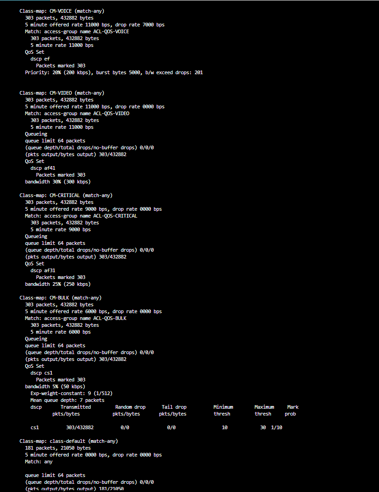
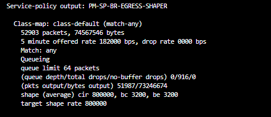
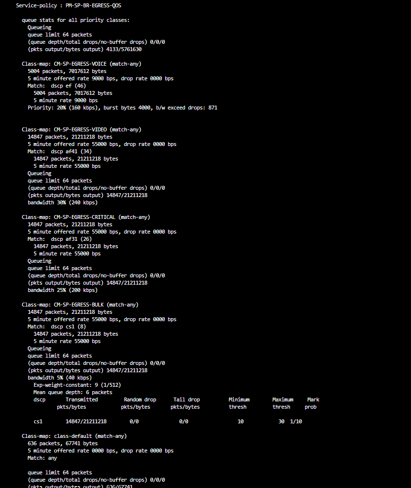
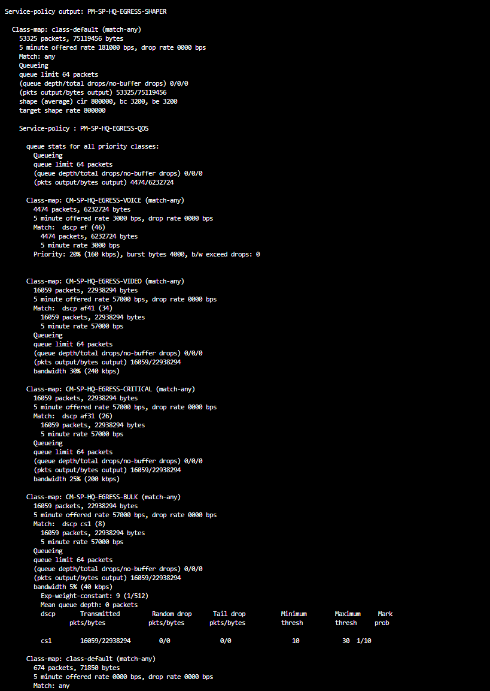

# QoS Congestion Test Results

This document records measured QoS behavior during controlled congestion tests performed across the Enterprise / Service Provider lab.

The tests validate:

- DSCP classification and marking
- Hierarchical QoS
- LLQ
- CBWFQ
- Parent shaping
- Bandwidth guarantees
- WRED
- Best Effort behavior
- Bidirectional provider QoS
- Parent/child drop accounting
- Bandwidth guarantee versus rate limiting

---

## 1. HQ QoS Classification and Marking

Traffic originates from dedicated HQ service networks.

```text
192.168.20.0/24 -> Voice
192.168.30.0/24 -> Video
192.168.40.0/24 -> Critical
192.168.50.0/24 -> Bulk
```

The customer CE applies:

```text
Voice    -> EF
Video    -> AF41
Critical -> AF31
Bulk     -> CS1
```

### Real Lab Evidence



The screenshot confirms that packets are classified and marked by the CE QoS policy.

Observed markings:

```text
CM-VOICE
-> DSCP EF

CM-VIDEO
-> DSCP AF41

CM-CRITICAL
-> DSCP AF31

CM-BULK
-> DSCP CS1
```

---

## 2. Customer WAN Hierarchical QoS

The permanent HQ CE WAN policy uses a 1 Mbps parent shaper.

```text
PM-WAN-SHAPER
        |
        | shape average 1000000
        |
        v
PM-HQ-QOS-OUT
```

Child treatment:

| Class | Treatment |
|---|---|
| Voice | LLQ 20% |
| Video | Bandwidth 30% |
| Critical | Bandwidth 25% |
| Bulk | Bandwidth 5% + WRED |
| Default | Remaining bandwidth |

---

# HQ to Branch Provider Congestion Test

Traffic direction:

```text
AMS-HQ-CE1
      |
      v
AMS-PE1
      |
      v
FRA-P1
      |
      v
LON-PE1
      |
      v
LON-BR-CE1
```

The controlled provider congestion point was:

```text
LON-PE1 Gi0/1
```

Provider service rate:

```text
800 kbps
```

For the controlled benchmark, the upstream CE shaper was temporarily increased so that `LON-PE1` became the primary congestion point.

---

## 3. LON-PE1 Parent Shaper

Provider egress parent policy:

```text
PM-SP-BR-EGRESS-SHAPER
```

Configured rate:

```text
shape average 800000
```

### Real Lab Evidence



The live screenshot confirms:

```text
Shape CIR: 800000 bps
Target shape rate: 800000 bps
```

It also shows real packets being queued and dropped at the provider customer-facing service boundary.

---

## 4. LON-PE1 Child QoS Policy

The parent shaper contains:

```text
PM-SP-BR-EGRESS-QOS
```

Classes:

```text
Voice
Video
Critical
Bulk
Best Effort
```

### Real Lab Evidence



The screenshot demonstrates:

```text
Voice
-> LLQ
-> priority percent 20

Video
-> bandwidth percent 30

Critical
-> bandwidth percent 25

Bulk
-> bandwidth percent 5
-> WRED

Default
-> remaining bandwidth
```

The screenshot contains live accumulated counters.

The controlled benchmark below was recorded separately during a dedicated test run.

---

## 5. Controlled HQ-to-Branch Benchmark

Parent result:

```text
Packets matched:      7598
Packets transmitted:  6249
Packets dropped:      1349

Shape rate:           800000 bps
```

Accounting:

```text
7598 - 6249 = 1349
```

---

## 6. Voice — EF / LLQ

Controlled result:

```text
Matched:             1515
Transmitted:          395
LLQ exceed drops:    1120

Priority:              20%
Priority rate:         160 kbps
```

Accounting:

```text
1515 - 395 = 1120
```

The Voice class is configured with:

```text
priority percent 20
```

At an 800 kbps parent:

```text
800 kbps × 20%
=
160 kbps
```

The test demonstrated that LLQ provides priority treatment but does not allow unlimited EF traffic to consume the shaped link.

Excess sustained priority traffic generated:

```text
b/w exceed drops
```

---

## 7. Video — AF41 / CBWFQ

Controlled result:

```text
Matched:       1515
Transmitted:   1508
Drops:            7

Bandwidth:       30%
Guarantee:      240 kbps
```

Important behavior:

```text
bandwidth percent 30
```

defines a minimum bandwidth guarantee.

It is not a maximum rate.

Video can use additional unused bandwidth when available.

---

## 8. Critical — AF31 / CBWFQ

Controlled result:

```text
Matched:       1515
Transmitted:   1439
Drops:           76

Bandwidth:       25%
Guarantee:      200 kbps
```

The class received its configured scheduling guarantee while still experiencing queue pressure during congestion.

---

## 9. Bulk — CS1 / WRED

Controlled result:

```text
Matched:       1491
Transmitted:   1491
Drops:            0

Bandwidth:        5%
Guarantee:       40 kbps
```

WRED result:

```text
Mean queue depth:   5 packets

Minimum threshold: 10
Maximum threshold: 30
Mark probability:  1/10

Random drops:       0
Tail drops:         0
```

The average WRED queue depth remained below the minimum threshold.

Therefore WRED did not begin probabilistic dropping.

---

## 10. Best Effort

Controlled result:

```text
Matched:       1562
Transmitted:   1416
Drops:          146
```

Best Effort had no explicit bandwidth guarantee.

It consumed remaining available bandwidth after the explicitly configured QoS classes competed for the shaped link.

---

## 11. Parent / Child Drop Accounting

Child drops:

```text
Voice:       1120
Video:          7
Critical:      76
Bulk:           0
Default:      146
-----------------
Total:       1349
```

Parent:

```text
Total drops: 1349
```

Therefore:

```text
1120 + 7 + 76 + 0 + 146
=
1349
```

This confirms that the parent congestion losses can be completely accounted for by the child queues.

---

# Branch to HQ Provider QoS

Traffic direction:

```text
LON-BR-CE1
      |
      v
LON-PE1
      |
      v
FRA-P1
      |
      v
AMS-PE1
      |
      v
AMS-HQ-CE1
```

The reverse provider congestion point was:

```text
AMS-PE1 Gi0/0
```

Provider service rate:

```text
800 kbps
```

---

## 12. AMS-PE1 Reverse-Direction Provider QoS

### Real Lab Evidence



The screenshot confirms that the reverse provider edge implements:

```text
PM-SP-HQ-EGRESS-SHAPER
        |
        | shape 800 kbps
        |
        v
PM-SP-HQ-EGRESS-QOS
```

with:

```text
Voice     -> LLQ 20%
Video     -> BW 30%
Critical  -> BW 25%
Bulk      -> BW 5% + WRED
Default   -> Remaining BW
```

The screenshot contains current live counters.

The dedicated controlled benchmark produced the results below.

---

## 13. Controlled Branch-to-HQ Benchmark

Parent:

```text
Matched:       5592
Transmitted:   4589
Dropped:       1003

Shape rate:    800000 bps
```

Accounting:

```text
5592 - 4589 = 1003
```

Child results:

| Class | Matched | Output | Drops |
|---|---:|---:|---:|
| Voice | 1111 | 286 | 825 |
| Video | 1111 | 1105 | 6 |
| Critical | 1111 | 1047 | 64 |
| Bulk | 1111 | 1111 | 0 |
| Default | 1148 | 1040 | 108 |

Drop accounting:

```text
825
+ 6
+ 64
+ 0
+ 108
=
1003
```

Again:

```text
Child drops
=
Parent drops
```

The same hierarchical QoS behavior was therefore reproduced in both directions.

---

# Bandwidth Guarantee vs Rate Cap

One of the most important experiments compared:

```text
bandwidth percent 5
```

against:

```text
shape average 40000
```

---

## 14. Bandwidth Guarantee Test

With:

```text
bandwidth percent 5
```

and an 800 kbps parent:

```text
Minimum guarantee
=
40 kbps
```

Observed:

```text
1491 matched
1491 transmitted
0 drops
```

The class transmitted substantially more than 40 kbps when unused bandwidth was available.

This proves:

```text
bandwidth percent
!=
rate cap
```

---

## 15. Per-Class Shaper Test

The Bulk class was temporarily changed to:

```text
shape average 40000
```

Observed:

```text
303 packets matched
213 packets transmitted
90 packets dropped

Target shape rate: 40000 bps
```

Accounting:

```text
303 - 213 = 90
```

This configuration imposed an actual average-rate limitation.

---

## 16. Guarantee vs Cap Summary

```text
bandwidth percent 5
```

means:

```text
Minimum guaranteed bandwidth
+
Ability to borrow unused capacity
```

while:

```text
shape average 40000
```

means:

```text
Average traffic rate constrained to approximately 40 kbps
```

This experiment demonstrated the difference between scheduling and shaping.

---

# WRED Behavior

The Bulk class uses:

```text
random-detect dscp-based
```

with CS1 thresholds:

```text
Minimum: 10 packets
Maximum: 30 packets
Probability: 1/10
```

WRED decisions are based on an exponentially weighted moving average of queue depth.

Therefore:

```text
Instantaneous queue depth
!=
WRED average queue depth
```

Random drops begin only after the calculated average crosses the configured minimum threshold.

---

# AF Drop Precedence Experiment

AF31 and AF33 were also tested with different WRED thresholds.

The test demonstrated:

```text
AF31
-> lower drop precedence

AF33
-> higher drop precedence
```

During congestion, AF33 experienced more aggressive dropping.

This reinforced the AFxy concept:

```text
x = forwarding class
y = drop precedence
```

Within the same AF class:

```text
AFx1
<
AFx2
<
AFx3
```

in drop precedence.

---

# Key Findings

The congestion experiments demonstrated:

- CE traffic is classified and marked correctly.
- Hierarchical QoS can deliberately create a controlled congestion point.
- LLQ protects latency-sensitive Voice traffic while preventing unlimited priority traffic.
- `bandwidth percent` provides a minimum guarantee rather than a maximum rate.
- CBWFQ classes can borrow unused capacity.
- Per-class shaping creates an actual rate constraint.
- Best Effort uses remaining bandwidth.
- WRED operates using average queue depth.
- Parent and child drop counters can be reconciled exactly.
- The provider QoS architecture behaves consistently in both directions.

---

# Conclusion

The lab validates QoS using more than configuration alone.

Evidence includes:

```text
Real IOSv policy counters
+
Queue statistics
+
LLQ exceed drops
+
WRED statistics
+
Parent/child drop accounting
+
Bidirectional testing
+
Wireshark packet captures
```

The result is a reproducible end-to-end QoS implementation across an Enterprise and Service Provider topology.
