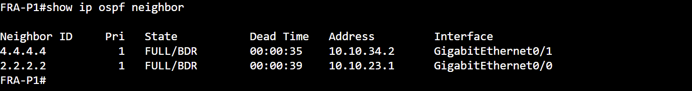
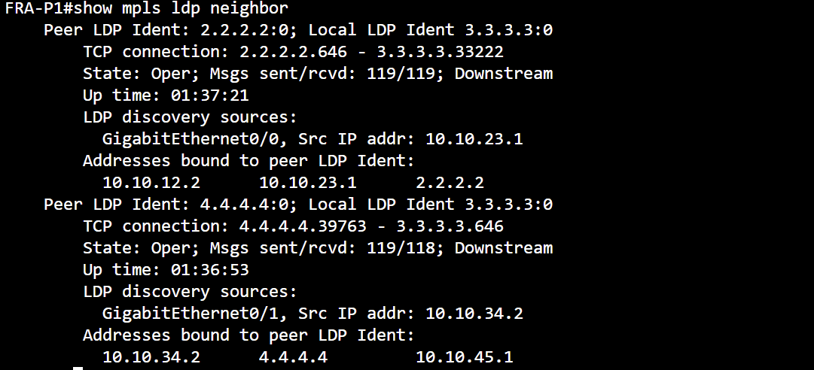
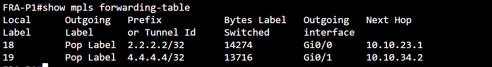

# Routing and MPLS Verification

This document provides operational evidence for the routing and MPLS transport used by the Enterprise / Service Provider QoS lab.

The transport architecture is:

```text
AMS-HQ-CE1 ---- AMS-PE1 ---- FRA-P1 ---- LON-PE1 ---- LON-BR-CE1
    CE             PE           P            PE             CE
```

The provider core uses:

- OSPF Area 0
- MPLS
- LDP

The customer/provider edge uses:

- eBGP between CE and PE
- iBGP between the PE routers

`FRA-P1` remains intentionally BGP-free.

---

## 1. Provider OSPF Architecture

OSPF runs only inside the Service Provider core:

```text
AMS-PE1
   |
   | 10.10.23.0/30
   |
FRA-P1
   |
   | 10.10.34.0/30
   |
LON-PE1
```

Provider router IDs:

```text
AMS-PE1  -> 2.2.2.2
FRA-P1   -> 3.3.3.3
LON-PE1  -> 4.4.4.4
```

Customer-facing interfaces are intentionally excluded from the provider OSPF domain.

---

## 2. OSPF Neighbor Verification

Verification command:

```text
show ip ospf neighbor
```

On `FRA-P1`, both Provider Edge routers should form FULL OSPF adjacencies.

Expected neighbors:

```text
2.2.2.2 -> AMS-PE1
4.4.4.4 -> LON-PE1
```

### Real Lab Evidence



The screenshot confirms that `FRA-P1` has established OSPF adjacency with both PE routers.

Expected state:

```text
AMS-PE1 -> FULL
LON-PE1 -> FULL
```

---

## 3. BGP Architecture

### HQ eBGP

```text
AMS-HQ-CE1 AS65010
        |
        | eBGP
        |
AMS-PE1 AS65100
```

Transit network:

```text
10.10.12.0/30
```

---

### Provider iBGP

```text
AMS-PE1
Lo0: 2.2.2.2
        |
        | iBGP AS65100
        |
LON-PE1
Lo0: 4.4.4.4
```

The iBGP session uses PE loopbacks.

---

### Branch eBGP

```text
LON-PE1 AS65100
        |
        | eBGP
        |
LON-BR-CE1 AS65020
```

Transit network:

```text
10.10.45.0/30
```

---

## 4. BGP Verification Commands

### AMS-HQ-CE1

```text
show bgp ipv4 unicast summary
```

Expected peer:

```text
10.10.12.2
Remote AS 65100
State Established
```

---

### AMS-PE1

```text
show bgp ipv4 unicast summary
```

Expected peers:

```text
10.10.12.1
Remote AS 65010
eBGP
```

and:

```text
4.4.4.4
Remote AS 65100
iBGP
```

---

### LON-PE1

```text
show bgp ipv4 unicast summary
```

Expected peers:

```text
2.2.2.2
Remote AS 65100
iBGP
```

and:

```text
10.10.45.2
Remote AS 65020
eBGP
```

---

### LON-BR-CE1

```text
show bgp ipv4 unicast summary
```

Expected peer:

```text
10.10.45.1
Remote AS 65100
State Established
```

---

## 5. BGP-Free Provider Core

`FRA-P1` intentionally does not run BGP.

Its responsibilities are limited to:

```text
OSPF
MPLS forwarding
LDP
```

This allows the P router to forward customer traffic without carrying customer BGP routes.

Conceptually:

```text
CE
 |
PE
 |
| BGP routes converted into MPLS forwarding
|
P
|
| Label switching only
|
PE
 |
CE
```

---

## 6. MPLS / LDP Architecture

MPLS is enabled only across the provider core:

```text
AMS-PE1 Gi0/1
      |
      | MPLS / LDP
      |
FRA-P1 Gi0/0

FRA-P1 Gi0/1
      |
      | MPLS / LDP
      |
LON-PE1 Gi0/0
```

MPLS is intentionally not enabled on customer-facing interfaces.

---

## 7. LDP Neighbor Verification

Verification command:

```text
show mpls ldp neighbor
```

Expected LDP peers on `FRA-P1`:

```text
2.2.2.2
4.4.4.4
```

### Real Lab Evidence



The screenshot confirms that LDP sessions are operational toward both Provider Edge routers.

---

## 8. MPLS Forwarding Verification

Verification command:

```text
show mpls forwarding-table
```

On `FRA-P1`, the MPLS forwarding table should contain label entries toward:

```text
2.2.2.2/32
4.4.4.4/32
```

### Real Lab Evidence



The forwarding table demonstrates MPLS label switching across the provider core.

---

## 9. Penultimate Hop Popping

The MPLS forwarding table can show:

```text
Pop Label
```

for routes toward the Provider Edge loopbacks.

This demonstrates Penultimate Hop Popping.

Conceptually:

```text
Ingress PE
   |
   | Label
   v
P Router
   |
   | Pop Label
   v
Egress PE
```

The penultimate router removes the transport label before forwarding the packet to the destination PE.

---

## 10. Customer Route Verification

### HQ to Branch

On `AMS-HQ-CE1`:

```text
show ip route 192.168.120.0
```

Expected:

```text
192.168.120.0/24
learned through eBGP
via AMS-PE1
```

---

### Branch to HQ

On `LON-BR-CE1`:

```text
show ip route 192.168.20.0
```

Expected:

```text
192.168.20.0/24
learned through eBGP
via LON-PE1
```

---

## 11. End-to-End Reachability

### HQ to Branch

Run on `AMS-HQ-CE1`:

```text
ping 192.168.120.1 source 192.168.20.1
```

Expected result:

```text
Success rate is 100 percent
```

---

### Branch to HQ

Run on `LON-BR-CE1`:

```text
ping 192.168.20.1 source 192.168.120.1
```

Expected result:

```text
Success rate is 100 percent
```

---

## 12. Verification Summary

The following infrastructure components were validated:

- OSPF Area 0 across the provider core
- FULL OSPF neighbor adjacencies
- eBGP between customer and provider routers
- iBGP between Provider Edge routers
- BGP-free provider P router
- MPLS enabled across provider links
- LDP neighbor establishment
- MPLS forwarding-table population
- Penultimate Hop Popping
- Customer route propagation
- Bidirectional end-to-end connectivity

---

## Conclusion

The routing and MPLS infrastructure successfully provides the transport foundation required by the QoS lab.

The architecture separates responsibilities cleanly:

```text
CE
-> Customer routing

PE
-> BGP + MPLS edge

P
-> OSPF + MPLS label switching

PE
-> BGP + MPLS edge

CE
-> Customer routing
```

This transport layer allows the QoS policies documented elsewhere in the project to be tested end-to-end.
